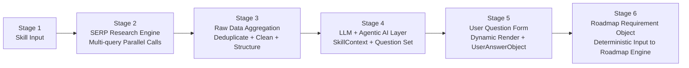

# SkillOS Pipeline Architecture (Interactive)

This diagram captures the end-to-end backend flow:
Skill Input -> SERP Multi-query -> Raw Aggregation -> LLM + Agentic Question Builder -> Dynamic Question Form -> Roadmap Requirement Object.

Click any node to jump to its detailed section below.



## Stage 1: Skill Input

Purpose:
- Accept raw skill name string from user input.

Input:
- skill_name (example: Digital Illustration)

Output:
- Skill trigger payload forwarded downstream.

Suggested contract:
```json
{
  "skill_name": "Digital Illustration"
}
```

## Stage 2: SERP Research Engine (Multi-query)

Purpose:
- Run parallel search intents per skill dimension to collect broad external evidence.

Required query dimensions:
- [skill] complete learning roadmap
- [skill] prerequisites beginner
- [skill] common mistakes learners make
- [skill] how long to learn
- [skill] best resources tutorials
- [skill] job requirements professional

Execution rule:
- Parallelized API calls only (asyncio.gather in Python).

Output:
- Raw SERP result groups keyed by dimension.

## Stage 3: Raw Data Aggregation

Purpose:
- Convert noisy search output into deterministic structured context for the LLM.

Required operations:
- Deduplicate overlapping fragments across all query dimensions.
- Remove ads, navigation noise, and irrelevant snippets.
- Normalize into stable JSON sections.

Required structured keys:
- skill_overview
- prerequisite_list
- resource_links
- failure_patterns
- time_estimates

Output contract:
```json
{
  "skill_overview": [],
  "prerequisite_list": [],
  "resource_links": [],
  "failure_patterns": [],
  "time_estimates": []
}
```

## Stage 4: LLM + Agentic AI Layer

Purpose:
- Produce deterministic skill analysis and a dynamic user question set.

Rule set:
- LLM receives only cleaned aggregation JSON.
- No raw SERP HTML or unstructured blobs.
- temperature = 0.
- Enforce schema validation.
- Retry once on schema failure, then fallback defaults.

Outputs:
1) SkillContextObject
```json
{
  "skill_name": "Digital Illustration",
  "complexity_score": 0.72,
  "prerequisite_gaps": ["color theory", "composition basics"],
  "estimated_phases": ["fundamentals", "technique", "style development"],
  "common_failure_modes": ["inconsistent practice", "tool paralysis"]
}
```

2) QuestionSetObject (dynamic form schema)
```json
[
  {
    "id": "goal_type",
    "type": "single_select",
    "label": "What is your primary goal?",
    "options": ["recreational", "professional"]
  }
]
```

## Stage 5: User Question Form

Purpose:
- Render agent-generated questions and capture user-specific constraints.

Supported control types:
- single_select
- numeric
- slider
- multi_select

Important behavior:
- Answers are additive constraints.
- Answers must not mutate SkillContextObject.

Output:
- UserAnswerObject

## Stage 6: Roadmap Requirement Object

Purpose:
- Merge skill analysis with user context for deterministic roadmap generation.

Merge rule:
- RoadmapRequirementObject = SkillContextObject + UserAnswerObject

Contains:
- Skill structure
- User constraints
- Time budget
- Risk zones

Output contract:
```json
{
  "skill_context": {},
  "user_answers": {},
  "roadmap_constraints": {}
}
```

---

## Determinism Rule (Critical)

The LLM must never ingest raw SERP HTML or unstructured search text.
Only the cleaned aggregation JSON is allowed as model input.

---

## Suggested Event Pipeline Mapping (Current Inngest Direction)

- skill/discover.requested -> Stage 2 + Stage 3 + Stage 4
- skill/research.compose.requested -> Stage 4 + Stage 5 answer merge + Stage 6
- roadmap/generate.requested -> Consumes Stage 6 output

This keeps search/research asynchronous while preserving deterministic roadmap generation.

---

## Click-to-Ask Guide

After clicking a stage node, ask a targeted follow-up in this format:
- Explain Stage 2 failure handling.
- Show JSON schema for Stage 4 output.
- Give retry logic for Stage 3 aggregation.
- Add observability metrics for Stage 6.
